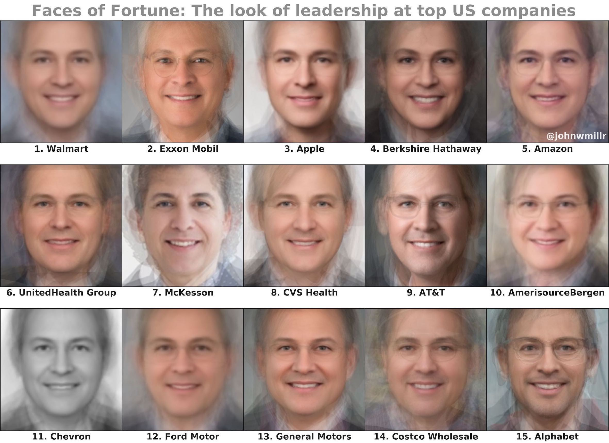

# Faces of Fortune

I've been playing with face averaging recently. After creating average faces for [rap, rock, and country musicians](https://www.reddit.com/r/dataisbeautiful/comments/crxrud/the_average_faces_of_rap_rock_and_country/), I wanted to work on a topic that might generate more serious conversation. So I decided to create representative average faces from the executive leadership for each of the top 50 Fortune 500 companies.

Check out [my blog post, Faces of Fortune](https://www.johnwmillr.com/faces-of-fortune/), for additional graphs and an explanation of how I created this post. Of course—as we all could likely guess—the results were as unsurprising as they are uninspiring. I'm interested in your responses. What questions come to mind when you see this post?

My hot take? #25 looks exactly like Mrs. Doubtfire.

**Source**:

  - I scraped the company executives' images from automated Google Image Searches.
  - Here's my [source code](https://github.com/johnwmillr/FacesOfFortune) for the project.
  - Here's my [blog post](https://www.johnwmillr.com/faces-of-fortune/) for the project.

**Tools**:

  - [Facer](https://github.com/johnwmillr/Facer)
  - Python and Matplotlib

For each of the top 50 companies on the Fortune 500 list, I programatically downloaded images of each member of the company's executive leadership (CEO, CFO, CTO, etc.). I then used my [Facer](https://github.com/johnwmillr/Facer) package to combine the images together into an average face for each company. Here's a [GIF](https://www.johnwmillr.com/assets/images/FaceAverages/AverageFace_Apple.gif) demonstrating the face averaging for Apple.
